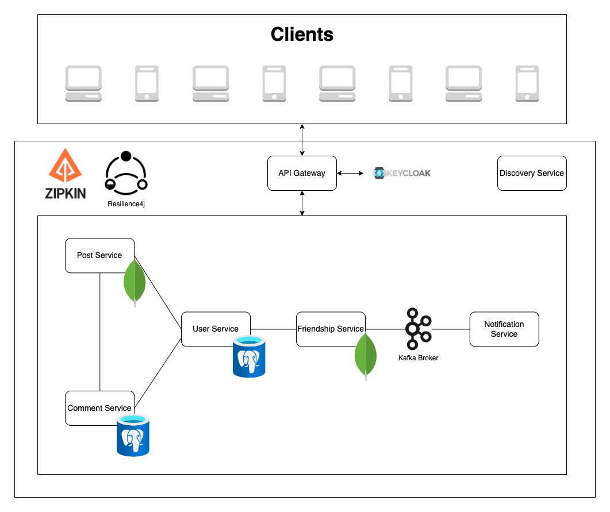

# Spring Social

An API-based social media where users can post, comment and send friend requests written using the Spring Boot
framework.

## Architecture



## Installation

1. Install [IntelliJ IDEA](https://www.jetbrains.com/idea/download) (*optional*)
2. Install Docker Desktop
   ([Windows](https://docs.docker.com/desktop/install/windows-install/),
   [Mac](https://docs.docker.com/desktop/install/mac-install/),
   [Linux](https://docs.docker.com/desktop/install/linux-install/))
3. Install [Postman](https://www.postman.com/downloads/)
4. Clone the repository
   ```shell
   git clone https://github.com/siomao/spring-social.git
   ```

## Running

1. Navigate to the folder repository
   ```shell
   cd spring-social
   ```
2. Build microservices' and databases' docker images and running containers
   ```shell
   docker-compose -p spring-social -f docker-compose.yml up -d
   ```

## Testing

1. Open Postman
2. Locate Postman collection using relative path `./postman/spring-social.postman_collection.json`
3. Drag and drop Postman collection to the Postman Desktop
4. Retrieve credentials to authenticate requests via API gateway with OAuth2.0 using `Keycloak`
    1. Navigate to `Keycloak` at <http://localhost:8080/auth>
    2. Retrieve `token_endpoint`
       from [OpenID Endpoint Configuration](http://localhost:8080/auth/realms/spring-social-realm/.well-known/openid-configuration)
    3. Under the [Clients](http://localhost:8080/auth/admin/master/console/#/realms/spring-social-realm/clients)
       navigation item on the left-hand side, click on `spring-social-client` to retrieve
       the `Client ID`
    4. Under Credentials tab, retrieve `Client Secret`
5. Authenticate requests using Postman Authorization Tab...

## REST API Endpoints

Request to these endpoints are passed through an API gateway which is authenticated and authorized with `Keycloak`

### Users

| api endpoint                     | method | description                          |
|----------------------------------|:------:|--------------------------------------|
| `/api/users`                     |  GET   | Retrieves users                      |
| `/api/users`                     |  POST  | Creates a user                       |
| `/api/users/{{userId}}`          |  PUT   | Updates a user                       |
| `/api/users/{{userId}}`          | DELETE | Deletes a user                       |
| `/api/users/{{userId}}`          |  GET   | Retrieves a user                     |
| `/api/users/{{userId}}/posts`    |  GET   | Retrieves a user with their posts    |
| `/api/users/{{userId}}/comments` |  GET   | Retrieves a user with their comments |

### Posts

| api endpoint                     | method | description                          |
|----------------------------------|:------:|--------------------------------------|
| `/api/posts?userId={{userId}}`   |  GET   | Retrieves posts                      |
| `/api/posts`                     |  POST  | Creates a post                       |
| `/api/posts/{{postId}}`          |  PUT   | Updates a post                       |
| `/api/posts/{{postId}}`          | DELETE | Deletes a post                       |
| `/api/posts/{{postId}}`          |  GET   | Retrieves a post                     |
| `/api/posts/{{postId}}/comments` |  GET   | Retrieves a post with their comments |

### Comments

| api endpoint                                        | method | description         |
|-----------------------------------------------------|:------:|---------------------|
| `/api/comments?userId={{userId}}&postId={{postId}}` |  GET   | Retrieves comments  |
| `/api/comments`                                     |  POST  | Creates a comment   |
| `/api/comments/{{commentId}}`                       |  PUT   | Updates a comment   |
| `/api/comments/{{commentId}}`                       | DELETE | Deletes a comment   |
| `/api/comments/{{commentId}}`                       |  GET   | Retrieves a comment |

### Friendship `/api/friendships`

| api endpoint                        | method | description            |
|-------------------------------------|:------:|------------------------|
| `/api/friendships`                  |  GET   | Retrieves friendships  |
| `/api/friendships`                  |  POST  | Creates a friendship   |
| `/api/friendships/{{friendshipId}}` |  PUT   | Updates a friendship   |
| `/api/friendships/{{friendshipId}}` | DELETE | Deletes a friendship   |
| `/api/friendships/{{friendshipId}}` |  GET   | Retrieves a friendship |

## Authors
* Jerome Delos Reyes
* Jayden Nguyen