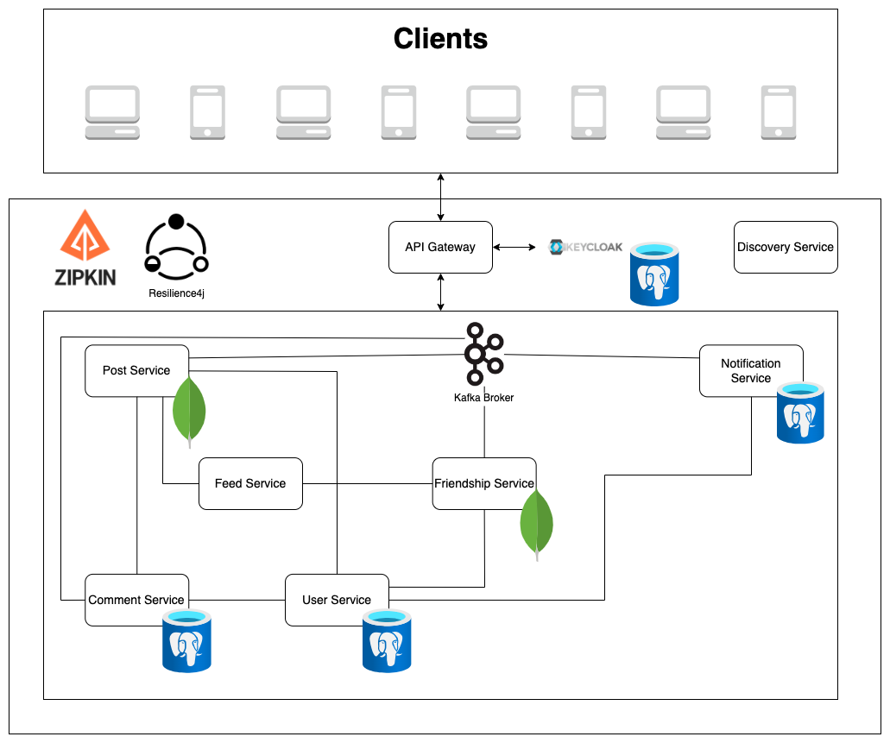

# Spring Social
An API-based social media where users can post, comment and send friend requests written using the Spring Boot framework.

## Architecture


## Installation

1. Install [IntelliJ IDEA](https://www.jetbrains.com/idea/download) (*optional*)
2. Install Docker Desktop
   ([Windows](https://docs.docker.com/desktop/install/windows-install/),
   [Mac](https://docs.docker.com/desktop/install/mac-install/),
   [Linux](https://docs.docker.com/desktop/install/linux-install/))
3. Install [Postman](https://www.postman.com/downloads/)
4. Clone the repository
   ```shell
   git clone https://github.com/siomao/spring-social.git
   ```

## Running

### Docker
1. Navigate to the folder repository (`spring-social`)
2. Initialize services and database
   ```shell
   docker-compose -p spring-social -f docker-compose.yml up -d
   ```
### IntelliJ IDEA (or any IDE of your choosing)
1. Initialize database
   ```shell
   docker network create spring-social
   docker run -d --name user-service --network=spring-social -p 5432:5432 -e POSTGRES_USER=rootadmin -e POSTGRES_PASSWORD=password -e POSTGRES_DB=user-service --restart unless-stopped postgres:latest
   docker run -d --name post-service --network=spring-social -p 27016:27017 -e MONGO_INITDB_ROOT_USERNAME=rootadmin -e MONGO_INITDB_ROOT_PASSWORD=password --restart unless-stopped mongo:latest
   docker run -d --name comment-service --network=spring-social -p 5433:5432 -e POSTGRES_USER=rootadmin -e POSTGRES_PASSWORD=password -e POSTGRES_DB=comment-service --restart unless-stopped postgres:latest
   docker run -d --name friendship-service --network=spring-social -p 27014:27017 -e MONGO_INITDB_ROOT_USERNAME=rootadmin -e MONGO_INITDB_ROOT_PASSWORD=password --restart unless-stopped mongo:latest
   ```
2. Run each service in IntelliJ IDEA

## Testing
1. Open Postman
2. Locate Postman collection using relative path `./postman/spring-social.postman_collection.json`
3. Drag and drop Postman collection to the Postman Desktop

## REST API Endpoints

### Users `/api/users`

* `GET /{userId}` - Retrieves a user
* `GET` - Retrieves users
* `POST` - Creates a user
* `PUT /{userId}` - Updates a user
* `DELETE /{userId}` - Removes a user
* `GET /{userId}/posts` - Gets a user with their posts
* `GET /{userId}/comments` - Gets a user with their comments
* `GET /{userId}/posts-with-comments` - Gets a user with their posts with comments

### Posts `/api/posts`

* `GET /{postId}` - Retrieves a post
* `GET` - Retrieves posts
* `POST` - Creates a post
* `PUT /{postId}` - Updates a post
* `DELETE /{postId}` - Removes a post
* `GET ?userId={userId}` - Retrieves posts
* `GET /user/{userId}/comments` - Retrieves posts with by userId

### Comments `/api/comments`

* `GET /{commentId}` - Retrieves a comment
* `GET ?userId={userId}&postId={postId}` - Retrieves comments
* `POST` - Creates a comment
* `PUT /{commentId}` - Updates a comment
* `DELETE /{commentId}` - Removes a comment

### Friendship `/api/friendships`

* `GET /{friendshipId}` - Retrieves a friendship
* `GET` - Retrieves friendships
* `POST` - Creates a friendship
* `PUT /{friendshipId}` - Updates a friendship
* `DELETE /{friendshipId}` - Removes a friendship
